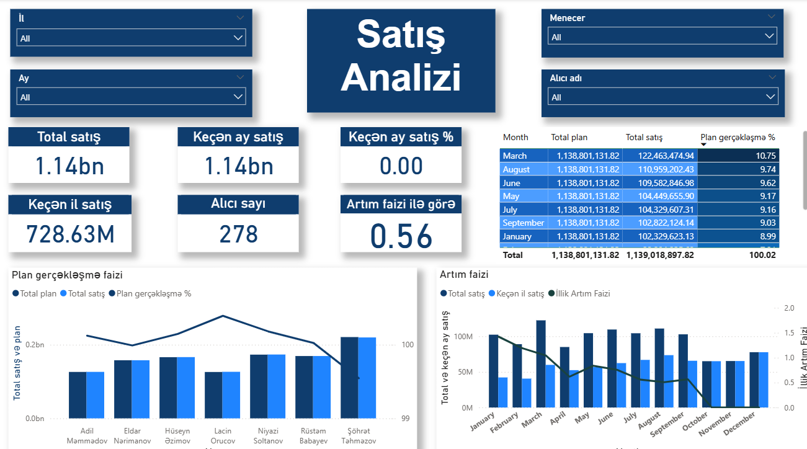

# Power BI ilə Satış Analizi

##  Layihə haqqında

Bu layihə Power BI istifadə etməklə satış məlumatlarının analitik və vizual təhlilinə həsr olunmuşdur. Məlumatlar müxtəlif mənbələrdən (qovluq və Excel faylları) əldə edilərək təmizlənmiş, model qurulmuş və vizualizasiyalar yaradılmışdır. Məqsəd satış göstəricilərini, planlarla müqayisəni və performans artımını ölçməkdir.

##  Məqsədlər

- Məlumatların Power BI vasitəsilə yüklənməsi və təmizlənməsi  
- Modeldə əlaqələrin qurulması  
- KPI göstəricilərinin yaradılması  
- Plan–satış müqayisəsi və gerçəkləşmə faizlərinin hesablanması  
- Vizual komponentlərin conditional formatting ilə zənginləşdirilməsi  
- Ay, il, menecer və alıcı kəsimlərində analizlərin aparılması  

##  İstifadə olunan texnologiyalar

- Power BI Desktop  
- Power Query Editor  
- DAX funksiyaları  
- Excel (.xlsx) faylları  
- Folder strukturu ilə CSV yükləmə  

##  Hesabatda yer alan əsas komponentlər

1. **Məlumatların yüklənməsi və əlaqələrin qurulması**  
2. **Vizual komponentlər (Card və Slicer)**  
3. **Plan və Satış müqayisələri (Chart və Table)**  
4. **Trend analizi**

##  Vizual görüntülər

#### Satış Analizi – Dashboard ümumi görünüş  

#### Detallı KPI göstəriciləri (Total satış, artım faizi və s.)  

##  Qeyd

Layihədə istifadə olunan məlumatlar real data deyil, yalnız təqdimat məqsədi ilə təqdim olunmuşdur.
